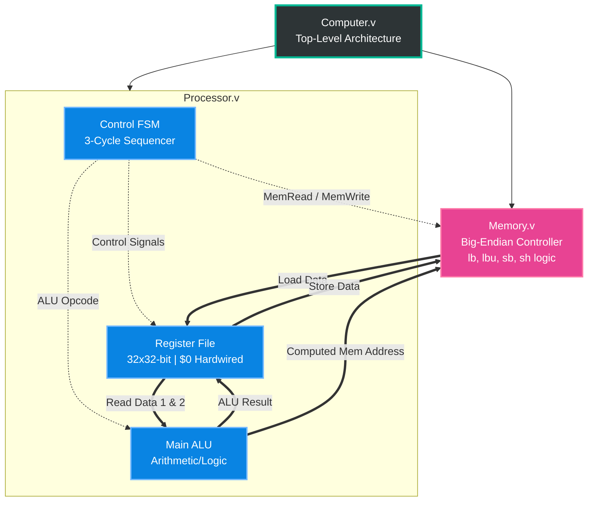

# 32-bit Custom MIPS Processor (3-Cycle Architecture) 

A custom 32-bit MIPS processor built from scratch in Verilog, completely synthesized and implemented for Xilinx 7-Series FPGA architecture (Target: Kintex-7 `xc7k480t`). This project was built as a course project for CS220 - Computer Organization and Architecture at IIT Kanpur under the supervision of [Prof. Mainak Chaudhuri](https://www.iitk.ac.in/dr-mainak-chaudhuri)

This project demonstrates full Register Transfer Level (RTL) design, finite state machine (FSM) control, critical-path timing optimization, and sub-word memory access. It successfully executes cross-compiled C code and meets all timing constraints at 100 MHz.

## System Architecture



## Detailed Architecture & Execution Flow

This processor deviates from the traditional 5-stage MIPS pipeline, utilizing a highly optimized **3-Cycle Finite State Machine (FSM)**. This approach reduces control-hazard complexities while maintaining distinct fetch, execute, and write-back phases.

### 1. Instruction Encoding
The control unit natively decodes the standard 32-bit MIPS instruction formats, extracting the appropriate opcodes, register addresses, and immediate values combinationally.

* **R-Type (Register):** Used for arithmetic and logical operations (`add`, `sub`, `and`, `or`, `sll`, `slt`).
    * `[31:26]` Opcode | `[25:21]` rs | `[20:16]` rt | `[15:11]` rd | `[10:6]` shamt | `[5:0]` funct
* **I-Type (Immediate):** Used for data transfer, branching, and immediate arithmetic (`lw`, `sw`, `beq`, `addi`).
    * `[31:26]` Opcode | `[25:21]` rs | `[20:16]` rt | `[15:0]` Immediate (Sign or Zero Extended)
* **J-Type (Jump):** Used for unconditional jumps (`j`, `jal`).
    * `[31:26]` Opcode | `[25:0]` Target Address

### 2. The 3-Cycle Execution FSM
The core control logic is governed by a synchronous FSM inside `Processor.v`, managing the datapath across three primary states:

* **State 0: Fetch & Decode**
    * The `ins` (instruction) wire continuously reads from the `Memory` module based on the current Program Counter (PC).
    * The FSM latches the extracted fields: `opcode`, `func`, `shift_amount`, and sign-extended immediates.
    * The `RegisterFile` is accessed combinationally, latching `src1` and `src2` for the next clock edge.
* **State 1: Execute & Memory Address Calculation**
    * The **Main ALU** processes `src1` and `src2` (or the immediate value) based on the decoded operation.
    * For memory instructions (`lw`, `sw`, `lb`, etc.), the ALU computes the effective memory address (`Base Address + Offset`).
    * If a memory read/write is required, the `data_addr_valid` flag asserts, preparing the Big-Endian memory controller for the next cycle. 
    * *Note: I/O handling (`syscall` read/print) halts standard execution here, transitioning to auxiliary wait-states to handshake with external environments.*
* **State 2: Write-back & PC Update**
    * The computed ALU result, or the fetched memory data, is written back to the destination register (`waddr`).
    * Branch conditions are evaluated (`branch_taken`). If true, the PC updates to the calculated branch offset or jump target.
    * If no branch is taken, the PC increments linearly (`PC <= PC + 1`), and the FSM loops back to State 0.

### 3. Big-Endian Sub-Word Memory Access
A standard 32-bit memory architecture inherently loads and stores full words. To support byte and half-word operations, custom extraction and alignment logic was built into the datapath:
* **Stores (`sb`, `sh`):** The logic uses the lowest 2 bits of the computed address as a byte-offset. It fetches the existing 32-bit word from memory, dynamically masks out the targeted 8 or 16 bits, splices in the new sub-word from the register file, and issues a write-back.
* **Loads (`lb`, `lbu`, `lh`, `lhu`):** The logic shifts the requested byte or half-word to the lowest significant bits and applies either a zero-extension (for unsigned) or a sign-extension (copying the MSB) before writing it to the destination register.

## Key Architectural Features
* **Fast-Adder Bypass:** To resolve critical path timing violations during memory access, a dedicated hardware adder (`fast_mem_addr = SRC1 + BRANCH_OFFSET`) bypasses the main ALU, allowing memory addresses to be computed instantly without waiting for the ALU propagation delay.
* **Big-Endian Memory Controller:** Custom byte-enable extraction logic built directly into the datapath to precisely handle sub-word instructions (`lb`, `lbu`, `lh`, `lhu`, `sb`, `sh`).
* **Hardwired `$0` Register:** The register file physically grounds register `$0` to prevent uninitialized data cascades during branching and loading operations.
* **Circular I/O Buffer:** Integrated an AXI-style hardware stall mechanism to securely buffer data out to a host environment without losing cycles.

## Performance & Hardware Metrics

The design was fully placed and routed using Vivado. It comfortably achieves timing closure at a **100 MHz clock (10.00 ns period)**.

| Metric | Value | Raw Report |
| :--- | :--- | :--- |
| **Target Frequency** | 100 MHz (10.00 ns) | [Timing Summary](./docs/Timing%20Summary.txt) |
| **Worst Negative Slack (WNS)** | **+1.132 ns** | [Timing Summary](./docs/Timing%20Summary.txt) |
| **Worst Hold Slack (WHS)** | **+0.136 ns** | [Timing Summary](./docs/Timing%20Summary.txt) |
| **Slice LUTs** | 1,498 (0.50% utilization) | [Utilization Report](./docs/Resource%20Utilization%20Report.txt) |
| **Slice Registers** | 357 (0.06% utilization) | [Utilization Report](./docs/Resource%20Utilization%20Report.txt) |
| **Total On-Chip Power** | 0.192 W | [Power Report](./docs/Power%20Report.txt) |

## Visual Documentation

Following are the physical logic mapping and timing simulations.

**[RTL Schematic (PDF)](./docs/MIPS%20Processor%20RTL%20Schematic.pdf)** - Register Transfer Level Layout of the different modules incorporated in the design.

<br>
*The physical layout and routing of the logic cells on the FPGA fabric after Place and Route.*


*Behavioral simulation proving correct instruction execution and state transitions.*

## Repository Structure

```text
MIPS-Processor/
├── README.md
├── docs/                                <-- Physical design proofs and reports
│   ├── Implemented Design.png
│   ├── MIPS Processor RTL Schematic.pdf
│   ├── Power Report.txt
│   ├── Resource Utilization Report.txt
│   ├── Simulation Waveform.png
│   └── Timing Summary.txt
├── src/
│   ├── rtl/                             <-- Hardware Description files
│   │   ├── ALU.v
│   │   ├── Computer.v
│   │   ├── Memory.v
│   │   ├── Processor.v
│   │   └── RegisterFile.v
│   ├── include/
│   │   └── defs.vh                      <-- Opcodes and global macros
│   └── tb/
│       └── Computer_tb.v                <-- State-based verification testbench
└── vivado/
    └── Processor System.xpr             <-- Clean Vivado Project File
```

## How to Build and Simulate

1. Clone the repository: `git clone https://github.com/Aman02032006/MIPS-Processor-Implementation.git`
2. Open **Vivado** and open the project file located at `vivado/Processor System.xpr`.
3. To view the waveforms, click **Run Simulation** -> **Run Behavioral Simulation**.
4. To view the physical architecture, click **Open Implemented Design**.
